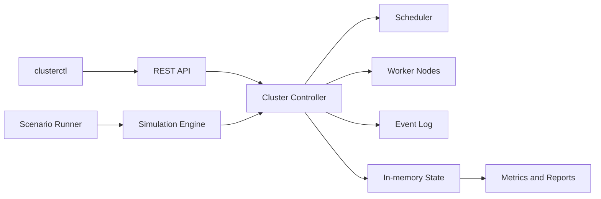

# Cluster Process Manager Simulator

A deterministic Go simulator for process scheduling and failure recovery in a cluster. It models a control node, worker nodes with finite CPU and memory, process lifecycle transitions, three scheduling algorithms, node/process failures, event logging, metrics, and reproducible experiment scenarios.

## Features

- process states from `NEW` through `READY`, `RUNNING`, paused/failure states, and terminal states;
- resource-safe Round Robin, Least Loaded, and Priority-Aware scheduling;
- deterministic tick execution plus an optional real-time loop;
- process pause, resume, simulated I/O wait/wake, kill, bounded restart, and rescheduling;
- node draining, offline, failure, heartbeat timeout, and recovery states;
- thread-safe controller with invariant checks and race-tested concurrent access;
- REST API, `clusterctl` client, and standalone scenario runner;
- structured events and JSON/CSV metrics reports;
- five checked-in experiment scenarios with seven reference runs, Docker image, and GitHub Actions CI.

The execution model is non-preemptive. Once placed, a process keeps its simulated allocation until it completes, waits for I/O, is paused, is killed, or is affected by a failure. Round Robin refers to circular node placement, not CPU time slicing.

## Requirements

- Go 1.26 or later
- Docker (optional)

The project uses only the Go standard library.

## Quick start

Run all checks:

```bash
make fmt-check
make vet
make test
make race
make build
```

Start the API:

```bash
go run ./cmd/server
```

In a second terminal, create a node and submit a process:

```bash
go run ./cmd/clusterctl node add --id node-1 --cpu 4 --memory 4096
go run ./cmd/clusterctl process submit --id p1 --cpu 1 --memory 256 --ticks 5 --priority 10
go run ./cmd/clusterctl simulation step --ticks 5
go run ./cmd/clusterctl report show
```

The API listens on `http://localhost:8080`. Use `clusterctl --server http://host:port ...` to target a different server.

## Run deterministic scenarios

Run a scenario and print a JSON report:

```bash
go run ./cmd/simulator -scenario scenarios/node-failure.json -format json
```

Export CSV or compare another scheduler without changing the fixture:

```bash
go run ./cmd/simulator -scenario scenarios/heterogeneous.json -format csv -output result.csv
go run ./cmd/simulator -scenario scenarios/heterogeneous.json -scheduler round-robin
```

Available fixtures are in [`scenarios/`](scenarios). Their checked-in baseline results and interpretation are in [`docs/experiments.md`](docs/experiments.md).

## Architecture



The controller serializes all mutations behind a mutex and gives schedulers immutable node snapshots. `Step()` applies scheduled failures/submissions, schedules ready processes, samples utilization, advances running processes, releases completed resources, and validates invariants. See [`docs/architecture.md`](docs/architecture.md) for lifecycle and recovery diagrams.

## Scheduling rules

- **Round Robin:** cycles through nodes in stable ID order and skips unavailable/full nodes.
- **Least Loaded:** minimizes `0.5 × CPU utilization + 0.5 × memory utilization`.
- **Priority-Aware:** schedules larger numeric priorities first, applies aging every five waiting ticks, and uses Least Loaded placement.

Every scheduler checks both CPU and memory capacity and considers only `ONLINE` nodes.

The only restart policies are `NEVER` and `ON_FAILURE`. Normal completion and a manual kill are final; `ON_FAILURE` retries only a failed attempt and never exceeds `maxRestarts`.

## REST API

The API prefix is `/api/v1`; health is available at `GET /healthz`. Main resources are:

- `/nodes` and node status/fail/recover actions;
- `/processes` and pause/resume/kill/fail actions;
- `/simulation` start/pause/step/reset/status/scenario operations;
- `/scheduler`, `/events`, `/metrics`, and `/reports`.

Request/response examples and the endpoint matrix are in [`docs/api.md`](docs/api.md).

## Configuration

| Variable | Default | Meaning |
|---|---:|---|
| `APP_PORT` | `8080` | HTTP port |
| `LOG_LEVEL` | `info` | JSON log level |
| `TICK_DURATION_MS` | `500` | Real-time tick duration |
| `HEARTBEAT_TIMEOUT_TICKS` | `0` | Missed-heartbeat threshold; `0` disables automatic detection |
| `DEFAULT_SCHEDULER` | `least-loaded` | Initial scheduler |
| `MAX_NODES` | `100` | Node admission limit |
| `MAX_PROCESSES` | `10000` | Process admission limit |
| `RANDOM_SEED` | `42` | Default deterministic seed |

Copy [`.env.example`](.env.example) when configuring a local environment. The server reads environment variables directly.

## Docker

```bash
docker compose up --build
curl http://localhost:8080/healthz
```

The multi-stage image contains only the static server binary and runs as a non-root user.

## Correctness and testing

Tests cover validation, legal state transitions, resource allocation/release, all schedulers, capacity deferral, pause/resume/kill, node and process failures, restart limits, heartbeat detection, deterministic replay, scenario validation, reports, API status codes, concurrent submissions, CLI behavior, and graceful real-time completion.

Reports distinguish submitted, started, and never-started processes. Waiting time is published both for started processes and for all submitted processes observed up to the report tick. Once no future scenario action remains, a run stops early with `NO_ONLINE_CAPACITY` when no ready process fits an online node, or `EXTERNALLY_BLOCKED` when only waiting/paused work remains and an external command is required.

The controller checks after each tick that:

- allocations remain within capacity;
- every running process belongs to exactly one node;
- node process lists and resource counters agree;
- terminal and queued processes retain no node allocation.

CI runs formatting, vet, unit/integration tests, the race detector, all binary builds, and a container build.

## Repository map

```text
cmd/                    server, clusterctl, and simulator entry points
internal/domain/        models, validation, states, and errors
internal/scheduler/     scheduling strategies
internal/cluster/       controller, lifecycle, invariants, and recovery
internal/engine/        deterministic and real-time execution
internal/metrics/       metrics and JSON/CSV export
internal/transport/http REST handlers
internal/store/         isolated in-memory and JSON snapshots
scenarios/              reproducible workloads
docs/                   architecture, API, and experiment results
```

## Scope

This is a local educational simulator. It does not execute user code, orchestrate real remote machines, implement distributed consensus, or provide production authentication.
