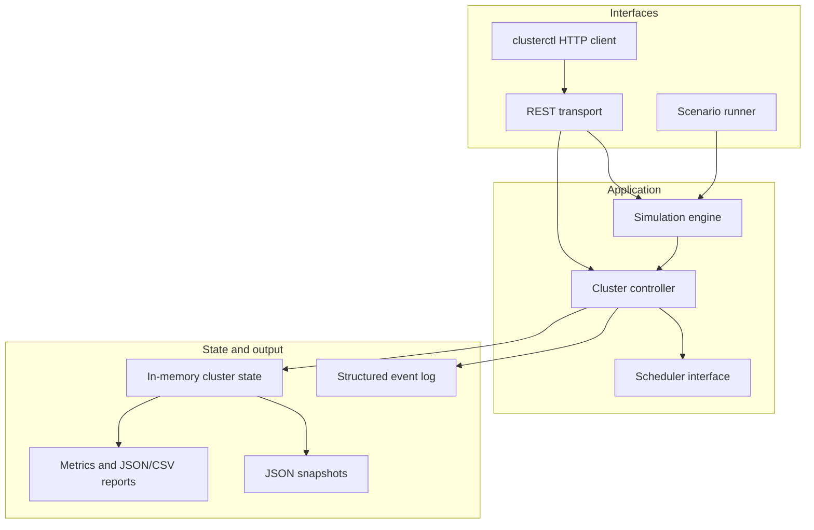
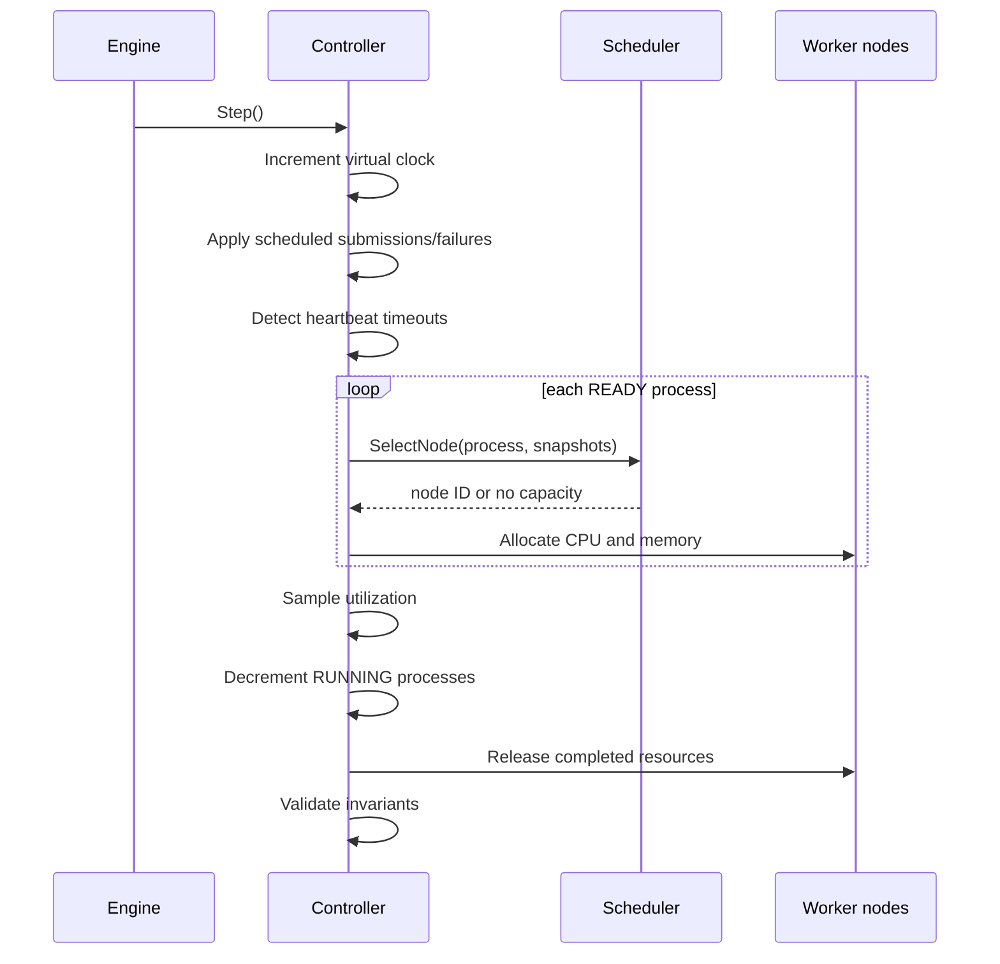
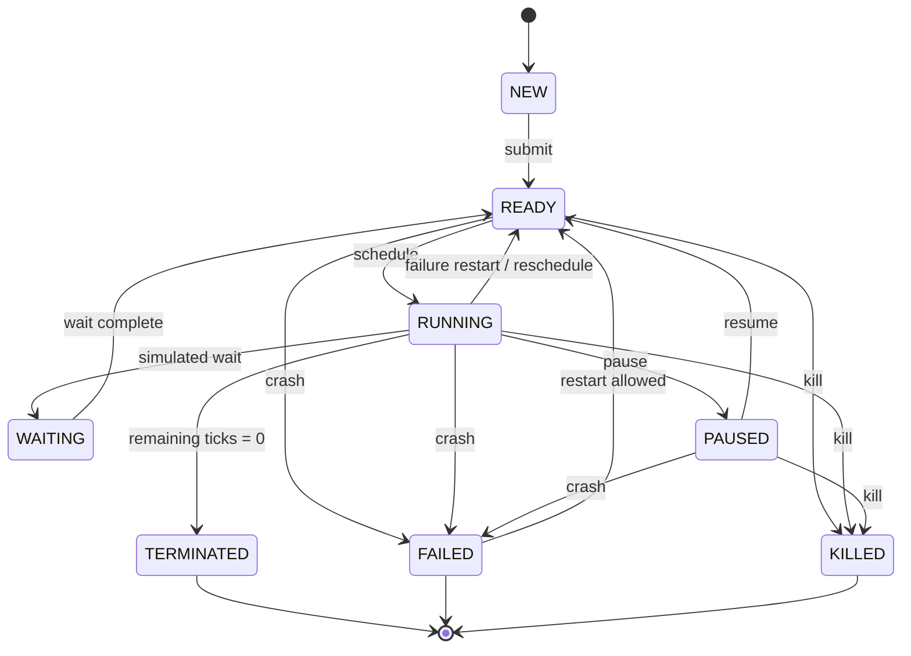
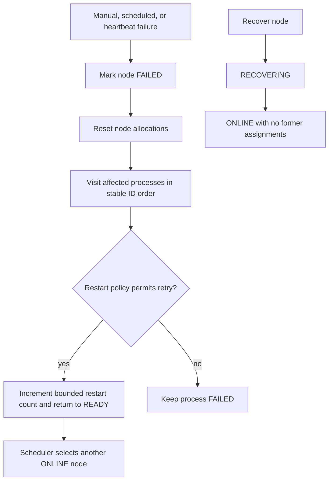

# Architecture

## Components

The controller is the sole owner of live state. Public mutations take an exclusive lock; snapshots and list operations take a read lock and return deep copies. Schedulers receive immutable `NodeSnapshot` values and cannot mutate cluster state.

## Tick sequence

The order is deterministic: process IDs and node snapshots use stable sorting, and scenario events occur on explicit virtual ticks. The same scenario, scheduler, and seed therefore produce the same result.

## Process lifecycle

Only `RUNNING` processes consume resources. Leaving `RUNNING` releases the exact CPU and memory request and removes the process from the node list.

## Node failure recovery

## Invariants

After every tick:

1. node CPU and memory allocations are between zero and capacity;
2. allocation counters equal the sum of requests for listed running processes;
3. every running process appears on exactly one node and its `NodeID` matches;
4. queued, paused, failed, killed, and terminated processes have no node assignment;
5. every node process ID exists in the process registry.

Failures are returned before a partially invalid command can corrupt an existing state. Snapshot consumers cannot mutate live objects because maps, slices, pointers, nodes, and processes are copied.

## Concurrency and shutdown

The real-time engine owns one cancellable ticker goroutine. `Pause` and `Close` cancel it and wait for completion. The HTTP server uses bounded read/write/header timeouts and a ten-second graceful shutdown. CI runs the complete suite with Go's race detector.
