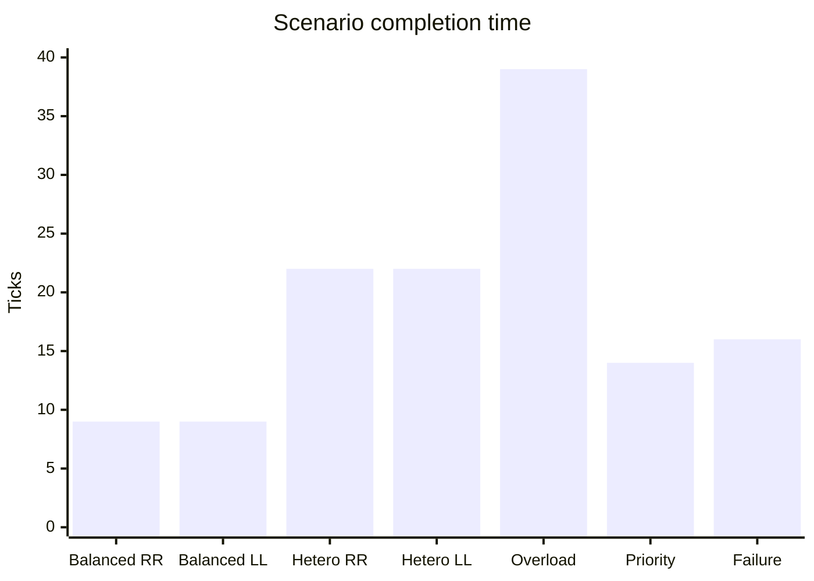
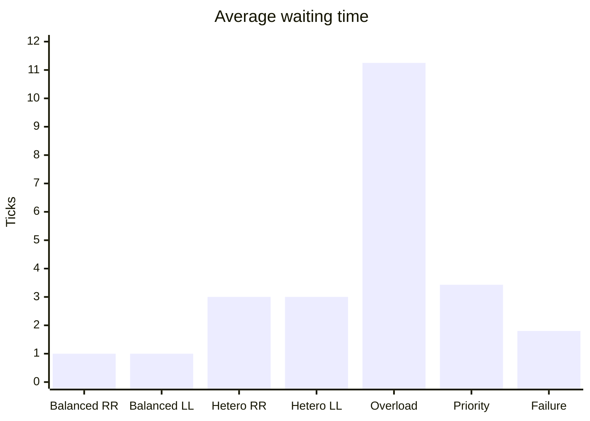

# Reproducible experiments

All baseline runs use seed `42` and the deterministic engine. Results were generated with:

```bash
go run ./cmd/simulator -scenario scenarios/<name>.json -format json
```

## Results

| Workload | Scheduler | Ticks | Avg wait (started) | Max wait (started) | Throughput | Avg CPU | Load σ | Deferrals | Restarts | Success |
|---|---|---:|---:|---:|---:|---:|---:|---:|---:|---:|
| Balanced | Round Robin | 9 | 1.00 | 1 | 1.333 | 52.22% | 0.1393 | 0 | 0 | 100% |
| Balanced | Least Loaded | 9 | 1.00 | 1 | 1.333 | 52.22% | 0.0987 | 0 | 0 | 100% |
| Heterogeneous | Round Robin | 22 | 3.00 | 13 | 0.273 | 49.68% | 0.2417 | 12 | 0 | 100% |
| Heterogeneous | Least Loaded | 22 | 3.00 | 13 | 0.273 | 49.68% | 0.2452 | 12 | 0 | 100% |
| Overload | Least Loaded | 39 | 11.25 | 31 | 0.205 | 89.10% | 0.0962 | 82 | 0 | 100% |
| Priority | Priority-Aware | 14 | 3.43 | 11 | 0.500 | 75.00% | 0.0469 | 18 | 0 | 100% |
| Node failure | Least Loaded | 16 | 1.80 | 5 | 0.313 | 54.17% | 0.2368 | 4 | 2 | 100% |





## Interpretation

The homogeneous balanced workload is intentionally a control case. Both schedulers finish in nine ticks with identical waiting time and throughput, but Least Loaded lowers the average cross-node load standard deviation from `0.1393` to `0.0987` (about 29%). This shows its balancing effect even when completion time is unchanged.

Every process starts in these seven baseline runs, so `averageWaitingTicksStarted` and `averageWaitingTicksAllSubmitted` have the same value. Runs that stop with unschedulable work also expose `neverStartedProcesses`; their all-submitted waiting metric includes observed ready time instead of hiding those processes.

The heterogeneous fixture also finishes identically for this fixed process order. Capacity checks prevent either scheduler from placing the largest jobs on undersized nodes; the very similar load deviation shows that admission constraints dominate the placement heuristic in this workload. New distributions can be compared without changing implementation by passing `-scheduler` to the runner.

Overload produces the expected cost: CPU remains busy for 89.10% of sampled ticks, but 82 scheduling attempts are deferred and average waiting rises to 11.25 ticks. No resources are overcommitted; queued work progresses as prior processes finish.

Priority-Aware runs urgent work first while aging prevents permanent starvation. Its workload finishes in 14 ticks with every process successful. Per-process state can be inspected through the scenario runner snapshot/API events when analyzing priority ordering in more detail.

The node-failure run fails `node-1` on tick 4. Two affected processes consume their allowed restart, return to `READY`, move to surviving nodes, and all five processes terminate. This adds seven ticks relative to the shortest balanced completion while retaining a 100% success rate.

## Reproducing comparisons

```bash
go run ./cmd/simulator -scenario scenarios/balanced.json -scheduler round-robin
go run ./cmd/simulator -scenario scenarios/balanced.json -scheduler least-loaded
go run ./cmd/simulator -scenario scenarios/heterogeneous.json -scheduler round-robin
go run ./cmd/simulator -scenario scenarios/heterogeneous.json -scheduler least-loaded
go run ./cmd/simulator -scenario scenarios/node-failure.json
```

Results are deterministic for a fixed scenario, scheduler, and seed. When random failure generation is extended in the future, repeat each configuration over multiple seeds and report mean, standard deviation, and confidence intervals.
